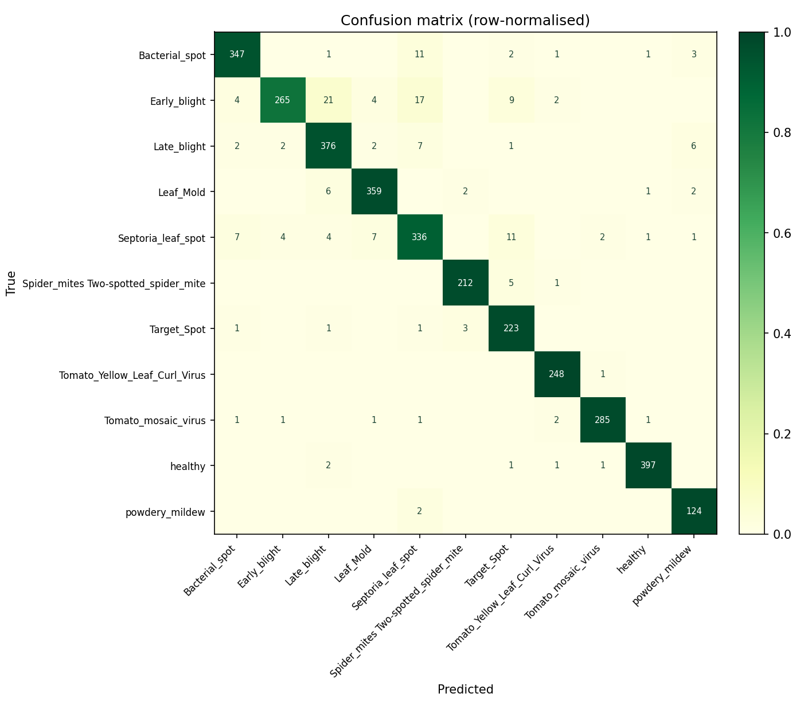

# Tomato Leaf Disease Detector

Transfer learning on MobileNetV2 to classify 11 tomato leaf conditions, served through a
Streamlit app that returns ranked predictions with treatment guidance in English and Urdu,
Grad-CAM explanations, and the full measured performance of the model it is running.

**Macro F1 0.9495 · accuracy 0.9488** on 3,343 held-out test images.



Built for an Applied AI & ML midterm. Every figure below comes from one real training run
on a Colab T4 and was independently reproduced on a local CPU — nothing here is estimated.

---

## Quick start

The repo ships the trained checkpoint and evaluation artifacts, so the app runs without
training anything:

```bash
git clone https://github.com/AliKhan84/tomato-disease-detector.git
cd tomato-disease-detector

conda create -n tomato python=3.11 -y && conda activate tomato
pip install -r requirements.txt

streamlit run src/streamlit_app.py        # from the repo root
```

TensorFlow publishes no wheels for Python 3.14, so use a **3.11–3.13** interpreter. The
same constraint governs deployment — see [Deploying](#deploying-to-streamlit-community-cloud).

Run it from the repo root: Streamlit resolves `.streamlit/config.toml` against the working
directory, so launching from `src/` silently drops the theme.

The sidebar's sample picker needs a local test split, which the repo does not ship (it is
1.5 GB of images). Without it the app works fine — you upload your own photos. To enable
it, download the dataset and run:

```bash
unzip archive.zip -d raw_data
python src/prepare_data.py --src raw_data
```

---

## Deploying to Streamlit Community Cloud

**Set the Python version to 3.11, 3.12 or 3.13 in Advanced settings before you click
Deploy.** This is the one step that cannot be recovered from later.

Community Cloud now defaults new apps to Python 3.14, and TensorFlow publishes wheels for
3.10–3.13 only. On 3.14 the build fails during dependency resolution with `No solution
found when resolving dependencies` / `no wheels with a matching Python ABI tag`, before the
app ever starts. No `requirements.txt` change can fix it — the wheels do not exist.

There is also **no file that pins the Python version**: `runtime.txt` is a Heroku
convention and Community Cloud ignores it. The version lives only in the deploy-time
dropdown, and [cannot be changed in place][upgrade-python] — changing it means deleting the
app and redeploying, so it is worth getting right the first time.

1. Deploy → pick repo, branch `main`, entrypoint `src/streamlit_app.py`
2. **Advanced settings → Python version → 3.11**
3. Deploy

If an app is already stuck on 3.14: note its subdomain, delete it, then redeploy with the
same subdomain and the correct version.

`requirements.txt` installs `tensorflow-cpu` (252 MB) rather than `tensorflow` (645 MB) on
Linux and Windows. Community Cloud has no GPU, so the CUDA stack in the larger wheel is
dead weight against a container that is memory-limited to begin with. macOS has no
`tensorflow-cpu` build and falls back to plain `tensorflow` via an environment marker.

[upgrade-python]: https://docs.streamlit.io/deploy/streamlit-community-cloud/manage-your-app/upgrade-python

---

## The app

Four tabs.

**Diagnose** — upload a leaf photo or load a held-out test image, and get the top-3 ranked
classes with confidence bars and treatment advice in English and Urdu.

**Model Performance** — macro F1, accuracy, per-class F1 with the weakest class flagged, a
confusion matrix that toggles between row shares and raw counts, the two-stage training
comparison, and the training curves. Every value is read from `reports/` at runtime, so the
tab cannot drift from the run that produced it. If a file is missing it says so rather than
inventing a number.

**Explainability** — Grad-CAM over the current image, the first-layer convolution filters,
and feature maps at three depths. A class selector asks the counterfactual question: *where
would the model look if this were some other disease?*

**Method & Limitations** — split strategy, architecture decisions, and the honest caveats.

A light/dark toggle sits at the top of the sidebar, under the leaf mark. Both themes come
from one set of semantic tokens that drive the CSS *and* the matplotlib figures, so charts
re-render in the active palette instead of glowing white on a dark page. Streamlit's own
fixed top bar is forced transparent, since `config.toml` can only declare one base and its
light band would otherwise sit across the top of the dark theme.

---

## Results

### Test set — 3,343 images the model never saw in training

| | |
|---|---|
| **Macro F1** | **0.9495** ← headline metric |
| Accuracy | 0.9488 (3,172 of 3,343 correct) |
| Weakest class | `Early_blight`, F1 0.8923 (recall 0.8230) |
| Strongest class | `healthy`, F1 0.9888 |

Macro F1 sitting slightly *above* accuracy is the useful detail: under a 3.1× class
imbalance, that ordering means no minority class was sacrificed to lift the average.
`powdery_mildew`, the smallest class at 126 test images, scores F1 0.9466.

Where the errors are: `Early_blight` is the one genuinely weak class — 21 of its 322 images
are called `Late_blight` and 17 `Septoria_leaf_spot`. All three present as dark necrotic
lesions, so this is the confusion a human would also make. `Target_Spot` and
`Septoria_leaf_spot` are the only others below 0.93.

### Two-stage training

| Stage | Backbone | Epochs | Best val accuracy |
|---|---|---:|---:|
| 1 | frozen | 8 | 0.8341 |
| 2 | top 35% unfrozen, `lr=1e-5` | 8 | **0.9422** |

Unfreezing was worth **+10.81 points** — the largest single improvement in the project, and
the reason the original frozen-backbone plan was revised mid-build.

Stage 1 plateaued with *training* accuracy below validation and both losses level. That is
the signature of underfitting, not overfitting: the frozen ImageNet features had given all
they had, so more epochs, a wider head, or heavier augmentation could not have helped — the
last would have made it worse. Unfreezing was the only lever that adds capacity.

Three things make stage 2 safe:

- **BatchNorm stays frozen at every depth,** including above the unfreeze cut. In Keras,
  `trainable = False` on a BatchNormalization layer also forces inference mode; letting its
  moving statistics update on small batches corrupts the pretrained representation within
  an epoch.
- **The learning rate drops 100×.** At stage 1's rate the first gradient updates would
  destroy the pretrained weights.
- **Stage 2 checkpoints to a separate file,** so the stage-1 model is never overwritten. If
  stage 2 fails to beat the frozen baseline, the notebook reloads stage 1, says so, and
  everything downstream uses it.

Validation accuracy was still rising at the final epoch — the run ended on its epoch cap,
not a ceiling, so the reported score is a floor for this configuration.

### Reproduced locally

`evaluate_model.py` was re-run on CPU against a split rebuilt from the archive:

```
Macro F1 : 0.9495
Accuracy : 0.9488
Test images: 3343
```

Identical to Colab in every per-class figure. The local `split_manifest.json` and the Colab
copy hash to the same SHA-256 over their assignment fields, which confirms the deterministic
split did its job: both machines chose the same 3,343 test images, so no test image was ever
trained on.

---

## Dataset

[Kaggle — Tomato Disease Multiple Sources](https://www.kaggle.com/datasets/cookiefinder/tomato-disease-multiple-sources)
· 32,535 images · 11 classes · ships pre-split as `train/` (25,851) and `valid/` (6,684).

| Class | train | valid |
|---|---:|---:|
| `Bacterial_spot` | 2,826 | 732 |
| `Early_blight` | 2,455 | 643 |
| `Late_blight` | 3,113 | 792 |
| `Leaf_Mold` | 2,754 | 739 |
| `Septoria_leaf_spot` | 2,882 | 746 |
| `Spider_mites Two-spotted_spider_mite` | 1,747 | 435 |
| `Target_Spot` | 1,827 | 457 |
| `Tomato_Yellow_Leaf_Curl_Virus` | 2,039 | 498 |
| `Tomato_mosaic_virus` | 2,153 | 584 |
| `healthy` | 3,051 | 806 |
| `powdery_mildew` | 1,004 | 252 |

Imbalance is 3.1× — `Late_blight` 3,905 against `powdery_mildew` 1,256.

### Split strategy: preserve the archive's boundary

```
archive/train/  ->  data/train/   25,851
archive/valid/  ->  data/val/      3,340
                ->  data/test/     3,343
```

This deliberately does **not** pool everything and reshuffle 70/15/15. The dataset
aggregates multiple sources — lab PlantVillage images alongside field photos — and contains
near-duplicates. Pooling puts near-duplicates on both sides of the split, so the test score
measures memorisation and reads far higher than the model deserves. A ~99% number from that
approach would be worth less than the 94.9% here.

Verified: zero `(class, filename)` pairs appear in both `train/` and `valid/`, and the
halving function partitions a list, so val and test cannot overlap.

The split is deterministic — filenames sorted first, RNG seeded per class, no reliance on
filesystem order — so any two machines produce byte-identical assignments.

### Two bad files, handled two different ways

`prepare_data.py` verifies every copied image and fixes what it can:

- **`valid/healthy/HL_(336).png`** is truncated and decodes in no library. It is deleted and
  recorded in the manifest under `excluded_undecodable`. This is why the test split is 3,343
  rather than 3,344.
- **Two files are WebP carrying a `.jpg` extension.** Pillow opens them happily, so a naive
  `Image.open()` check passes — but `tf.io.decode_image` accepts only JPEG/PNG/GIF/BMP and
  raises `Unknown image file format` mid-iteration. They are **re-encoded to real JPEG in
  place**, not deleted, so every split count is unchanged.

Repairing rather than deleting matters: dropping a file would shift that class's count and
make local totals disagree with the numbers an already-completed training run reported.

The verification runs *after* the split, not inside the file listing. Filtering earlier would
change each class's image count and therefore which files land in val vs test — silently
desyncing the split from an already-trained model.

---

## Architecture

```
Input(224, 224, 3)
RandomFlip("horizontal") ─┐
RandomRotation(0.1)       ├─ augmentation, on raw 0–255
RandomContrast(0.1)      ─┘
Rescaling(1/127.5, -1)      → [-1, 1], what MobileNetV2 expects
MobileNetV2                 → imagenet weights; top 35% unfrozen in stage 2
GlobalAveragePooling2D()
Dropout(0.2)
Dense(11, softmax)
```

Two things are load-bearing:

**Augmentation runs before `Rescaling`.** `RandomContrast` rescales around the mean assuming
0–255 input; applying it to already-normalised [-1, 1] data distorts images rather than
augmenting them.

**Preprocessing lives inside the model.** The saved `.keras` file carries its own
normalisation, so inference passes a plain 0–255 array and cannot drift out of sync with
training.

Training used `class_weight="balanced"` against the 3.1× imbalance, and evaluation leads with
macro F1 — plain accuracy lets a failing minority class hide behind the majority ones.

### Grad-CAM through a nested model

`src/explain.py` cannot use the textbook recipe. `Model(model.input, [conv.output,
model.output])` fails here because the backbone is a **nested** Functional model: `out_relu`
belongs to the inner graph, which the outer `Sequential` never exposes, so Keras 3 raises a
graph-disconnected error. Instead `split_model()` cuts the stack into (preprocessing,
backbone, head) and re-runs the segments manually — same layers, same weights, exact, and it
survives the nesting.

### Why caching is asymmetric in `dataset.py`

`image_dataset_from_directory` yields decoded float32. Caching the training set in memory
would cost roughly `25,851 × 224 × 224 × 3 × 4 bytes ≈ 15 GB` against a free Colab T4's
~12.7 GB — the session dies mid-epoch-1 with "your runtime has crashed". Train gets
`prefetch` only; val and test are ~8× smaller and cache safely.

---

## Training it yourself

`notebooks/train.ipynb` is self-contained: mounts Drive, unzips, builds the splits, trains
both stages, evaluates, renders the explainability figures, and packages everything.

1. Upload `archive.zip` to Google Drive (once — re-uploading 1.4 GB per session is slow)
2. Open the notebook in Colab, set `Runtime → Change runtime type → T4 GPU`
3. Run all — roughly 50–70 minutes
4. Download `artifacts.zip` and unzip it at the repo root

Set `FINE_TUNE = False` in section 9b to stop after stage 1.

Section 4 writes copies of `prepare_data.py`, `dataset.py` and `model.py` so the notebook
needs no clone. They mirror `src/` — if you change split logic in one, change it in both.

---

## Project layout

```
├── notebooks/train.ipynb       # self-contained Colab training
├── run_app.sh                  # launches the app on a known-good interpreter
├── src/
│   ├── prepare_data.py         # archive -> data/train|val|test + manifest
│   ├── dataset.py              # get_datasets() -> tf.data pipelines
│   ├── model.py                # build_model(), compile_model()
│   ├── advice.py               # EN/UR treatment text, normalised lookup
│   ├── infer.py                # load_model(), predict()
│   ├── explain.py              # Grad-CAM, conv filters, feature maps
│   ├── interpreter_guard.py    # re-exec onto an interpreter that has TensorFlow
│   ├── evaluate_model.py       # local re-evaluation
│   └── streamlit_app.py        # the 4-tab UI
├── models/                     # checkpoint, class_names.json, split_manifest.json
├── reports/                    # metrics, classification report, figures
└── .streamlit/config.toml      # repo root, NOT src/
```

### The `class_names.json` contract

Class order comes from `image_dataset_from_directory`, which sorts alphabetically. Training
writes that order to `models/class_names.json`; `infer.py` reads it back. Nothing is copied
by hand.

`advice.py` looks up entries **normalised** — lowercased, non-alphanumerics stripped — plus
an alias table, so `Tomato___Late_blight`, `Late blight` and `late-blight` all resolve to the
same record. All 11 real class names resolve with no fallbacks, including the awkward
`Spider_mites Two-spotted_spider_mite`. An unknown class returns a visible placeholder rather
than a blank card.

---

## Limitations

Worth stating plainly:

- **No real-world validation.** Every number comes from held-out images of the same Kaggle
  dataset. Performance on a phone photo taken in an actual field is unmeasured and will
  likely be worse — much of the source data is lab imagery on uniform backgrounds. The
  Grad-CAM view is the cheapest available check that the model reads leaf tissue rather than
  background, but it is not a substitute for field testing.

- **Closed-set classifier — and the confidence score does not compensate.** Softmax always
  sums to 1, so a photo with no leaf in it still produces a confident ranking. This was
  measured, not assumed. Against 220 real test images (median top-1 **0.998**, mean 0.954),
  synthetic non-leaf inputs scored:

  | Input | Top-1 | Predicted |
  |---|---:|---|
  | solid grey square | 0.982 | `Late_blight` |
  | crude drawn face | 0.989 | `Tomato_mosaic_virus` |
  | uniform noise | 0.894 | `healthy` |
  | plain blue field | 0.538 | `Late_blight` |

  Those confidences sit inside the real-leaf range, so **no threshold separates them**.
  Prediction entropy is no better — the grey square scores 0.101, *below* the 0.138 mean of
  genuine leaves. The 50% flag in the UI catches ambiguous *leaf* photos (~1.4% of the test
  set), not wrong subjects, and the app says so rather than implying it is a safeguard. Real
  out-of-distribution rejection needs an explicit background class or a dedicated OOD method.
  Caveat on this measurement: the negative inputs are synthetic — solid colours, noise, simple
  drawings — not photographs of real non-leaf objects.

- **`Early_blight` is genuinely weak.** F1 0.8923, recall 0.8230 — nearly one in five missed,
  mostly to `Late_blight` and `Septoria_leaf_spot`. Any real deployment should treat a
  confident `Early_blight`/`Late_blight` distinction with suspicion, since the two carry very
  different urgency.

- **Grad-CAM is coarse, and not uniformly reassuring.** The heatmap is a 7×7 grid upsampled to
  224×224, so each cell covers a 32×32 block. Across four spot-checked test images the model
  predicted all four correctly, and on `Early_blight`, `Late_blight` and `Leaf_Mold` the heat
  sits on the lesion. On the `Bacterial_spot` example a large share of the attention sits
  above the leaf tip, on background — one sample, not a trend, but the reason the figure is
  committed in `reports/gradcam.png` rather than summarised away.

- **Partial fine-tuning only.** The bottom 65% of the backbone stays frozen and every
  BatchNorm layer is held in inference mode. A full unfreeze with a longer schedule and LR
  warmup would probably add more, at meaningfully higher risk of wrecking the pretrained
  features.

- **Static advice text.** General horticultural guidance, not reviewed by an agronomist, with
  no regional or cultivar specificity.

- **Single held-out split.** No cross-validation, no confidence intervals on any metric.

---

## Troubleshooting

**`ModuleNotFoundError: No module named 'tensorflow'` even though it is installed.** Your
`streamlit` is resolving to a different interpreter than the one you installed into — common
when pyenv shims sit ahead of a conda env on `PATH`, in which case `python`, `streamlit` and
even `conda run -n <env>` all miss the env despite a correct-looking prompt.

`src/interpreter_guard.py` handles this automatically: it runs before any TensorFlow import,
finds an interpreter that has TF, and re-executes the same command under it, so the server
restarts itself on the same port and you reload the page. Override the choice with
`TOMATO_PYTHON=/path/to/python streamlit run src/streamlit_app.py`, or use `./run_app.sh`,
which picks the interpreter directly with no restart hop.

---

## Licence and attribution

Course-project prototype. Model trained on the Kaggle "Tomato Disease Multiple Sources"
dataset and validated only on held-out images from that same dataset — not on real field
photography. Treatment text is general horticultural guidance and has not been reviewed by an
agronomist. Confirm any diagnosis with a local agricultural extension service before treating
a crop.
